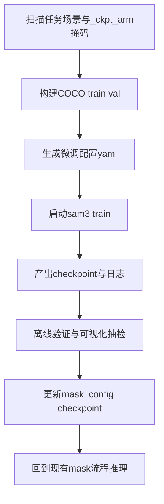

# SAM3 微调详细方案

## 1. 目标与边界

### 1.1 主目标
- 让 [`arm_text_prompt`](robotarm_sam/mask_config.yaml:31) 在第 0 帧有更高命中率与更稳定的初始 mask
- 微调对象限定为图片模型入口 [`build_sam3_image_model()`](sam3/model_builder.py:560)
- 推理侧保持现有视频流程不改，仍由 [`mask_1_arm.ipynb`](robotarm_sam/mask_1_arm.ipynb) 与 [`mask_pipeline_tools.py`](robotarm_sam/mask_pipeline_tools.py) 负责传播与导出

### 1.2 不在本轮范围
- 不改视频模型入口 [`build_sam3_video_model()`](sam3/model_builder.py:653)
- 不阅读与改写任何 ipynb 内容
- 不做集群调度改造，优先本地多卡配置

---

## 2. 已确认的仓库事实与约束

### 2.1 训练入口与配置机制
- 训练主入口为 [`main()`](sam3/train/train.py:140) 调用链，CLI 由 [`if __name__ == '__main__'`](sam3/train/train.py:312) 解析
- 配置通过 Hydra 模块初始化 [`initialize_config_module()`](sam3/train/train.py:313)
- `-c` 参数传入的是 `sam3.train` 配置模块下的相对 YAML 路径，见 [`--config` 参数定义](sam3/train/train.py:316)

### 2.2 数据加载方式
- 图片训练集使用 [`Sam3ImageDataset`](sam3/train/data/sam3_image_dataset.py:270)
- COCO JSON 由 [`COCO_FROM_JSON`](sam3/train/data/coco_json_loaders.py:104) 读取
- 该 loader 会把输入 `bbox` 视作 COCO `xywh` 并归一化，见 [`convert_boxlist_to_normalized_tensor()`](sam3/train/data/coco_json_loaders.py:18) 与 [`annotation['bbox'] = bbox`](sam3/train/data/coco_json_loaders.py:227)
- 若 JSON 中提供 `segmentation`，会在 [`ann_to_rle()`](sam3/train/data/coco_json_loaders.py:72) 处理后进入训练样本

### 2.3 现有管线关键参数
- 当前文本提示在配置中为 [`arm_text_prompt`](robotarm_sam/mask_config.yaml:31)
- 当前推理 checkpoint 路径来自 [`sam3_checkpoint`](robotarm_sam/mask_config.yaml:14)
- 导出 `arm-only` 掩码使用 [`save_arm_only_masks_for_propainter()`](robotarm_sam/mask_pipeline_tools.py:704)

### 2.4 官方参考配置特征
- 官方参考训练配置是 [`roboflow_v100_full_ft_100_images.yaml`](sam3/train/configs/roboflow_v100/roboflow_v100_full_ft_100_images.yaml)
- 该配置默认 `trainer.model` 未显式传 `checkpoint_path`，见 [`trainer.model`](sam3/train/configs/roboflow_v100/roboflow_v100_full_ft_100_images.yaml:315)
- 但本仓库模型构建器支持 `checkpoint_path`，见 [`build_sam3_image_model(checkpoint_path=...)`](sam3/model_builder.py:564)

---

## 3. 总体执行策略

采用四段式闭环：
1. 数据集构建：从 `_ckpt_arm` 生成 COCO 训练集
2. 训练配置：新建 robotarm 专用 YAML
3. 训练与验证：本地单机多卡训练，周期性验证
4. 回灌推理：将最佳 checkpoint 写回配置并跑既有管线



---

## 4. 详细实施方案

## 4.1 阶段 A 数据集构建

### A1 新增脚本
- 新建 [`robotarm_sam/build_finetune_dataset.py`](robotarm_sam/build_finetune_dataset.py)
- 输入来源
  - 原图目录模式：`{data_base}/{task}/train/{scene}/cam_105422061350/color/*.png`
  - 掩码目录模式：`{export_base}/{task}/{scene}_ckpt_arm/*.png`
- 输出目录建议
  - `output_dir/images/{task}/{scene}/{frame}.png`
  - `output_dir/train/annotations.json`
  - `output_dir/val/annotations.json`

### A2 数据转换规则
- 仅采样关键帧，默认 `sample_stride=30`
- 必须保留首尾帧
- 每帧执行
  - 读取 mask 并二值化
  - 空 mask 直接跳过
  - 计算 tight bbox，写 COCO `xywh`
  - 编码 `segmentation` 为压缩 RLE
  - 写入 `images` 与 `annotations`
- `categories` 固定单类，`name` 使用文本提示默认值 `robot and cable`

### A3 划分策略
- 按 scene 划分 train/val，避免帧级泄漏
- 支持两种方式
  - 手工指定 val scenes
  - 自动按 `val_ratio` 取尾部若干 scene

### A4 构建后质检
- 输出统计项
  - 场景总数
  - train/val 图像数
  - 跳过计数 no-mask 与 empty-mask
- 最低质检门槛
  - train 与 val 都必须非空
  - 每个 split 的 `images` 与 `annotations` 数量一致

---

## 4.2 阶段 B 训练配置

### B1 新建配置文件
- 新建 [`sam3/train/configs/robotarm/robotarm_full_ft.yaml`](sam3/train/configs/robotarm/robotarm_full_ft.yaml)
- 以 [`roboflow_v100_full_ft_100_images.yaml`](sam3/train/configs/roboflow_v100/roboflow_v100_full_ft_100_images.yaml:1) 为母版精简改造

### B2 必配项
- `paths`
  - `dataset_root`
  - `experiment_log_dir`
  - `bpe_path`
  - `checkpoint_path`
- `scratch.enable_segmentation: True`
- `trainer.model.enable_segmentation: ${scratch.enable_segmentation}`
- `trainer.model.checkpoint_path: ${paths.checkpoint_path}`
- `trainer.skip_saving_ckpts: false`
- `checkpoint.save_dir: ${launcher.experiment_log_dir}/checkpoints`

### B3 数据段改造
- train dataset
  - `img_folder: ${paths.dataset_root}/images`
  - `ann_file: ${paths.dataset_root}/train/annotations.json`
- val dataset
  - `img_folder: ${paths.dataset_root}/images`
  - `ann_file: ${paths.dataset_root}/val/annotations.json`
  - `coco_json_loader.include_negatives: false`
  - `coco_json_loader.category_chunk_size: 1`

### B4 loss 与 transforms
- 训练 transform 保留 [`DecodeRle`](sam3/train/configs/roboflow_v100/roboflow_v100_full_ft_100_images.yaml:28)
- val transform 同样启用 [`DecodeRle`](sam3/train/configs/roboflow_v100/roboflow_v100_full_ft_100_images.yaml:28) 的等价项
- loss 改为 mask 版本，包含
  - box loss
  - class/presence loss
  - mask/dice loss

### B5 资源参数建议
- `launcher.gpus_per_node` 先按 2
- `scratch.train_batch_size: 1`
- `scratch.gradient_accumulation_steps: 4`
- `scratch.num_train_workers` 先 4
- `submitit.use_cluster: False`

---

## 4.3 阶段 C 训练执行

### C1 标准命令
在仓库根目录执行：

```bash
python sam3/train/train.py \
  -c configs/robotarm/robotarm_full_ft.yaml \
  --use-cluster 0 \
  --num-gpus 2
```

### C2 关键输出目录
- 主目录：`${paths.experiment_log_dir}`
- 必看文件
  - `config.yaml`
  - `config_resolved.yaml`
  - `logs/`
  - `tensorboard/`
  - `checkpoints/`

### C3 训练过程检查点
- 首轮启动检查
  - 能成功读到 train/val JSON
  - 无 `missing annotation file` 报错
- 中途检查
  - val 周期有输出
  - loss 曲线稳定下降或波动可解释
- 结束检查
  - checkpoint 实际存在
  - 至少有 last 或 epoch checkpoint

---

## 4.4 阶段 D 评估与回灌

### D1 离线评估基线
- 选定固定验证场景子集
- 在微调前保存一次 baseline 结果
- 微调后同样场景复跑对比

### D2 指标建议
- 训练指标
  - box 指标
  - segm 指标
- 业务指标
  - 第 0 帧文本提示成功率
  - 首次传播后丢失帧占比

### D3 回灌路径
- 将最佳 checkpoint 路径写入 [`sam3_checkpoint`](robotarm_sam/mask_config.yaml:14)
- 保持 [`arm_text_prompt`](robotarm_sam/mask_config.yaml:31) 不变，先做同 prompt A/B 对比

### D4 回归验证
- 使用既有流程导出 arm-only mask
- 关注
  - 初始帧目标定位稳定性
  - 漏检与误检变化
  - 对后续 gripper 分离的连带影响

---

## 5. 风险与对应控制

### R1 过拟合与遗忘
- 现象：训练集上升但验证恶化
- 控制：降低 `lr_scale`，加大采样跨度，优先选最佳 val checkpoint

### R2 掩码语义偏差
- 现象：模型学到 arm-minus-gripper 而非 arm 本体
- 控制：训练数据严格使用 `_ckpt_arm`，不混入 merge 输出

### R3 数据分布偏差
- 现象：某些 scene 表现极差
- 控制：按任务和场景分层抽样，确保 val 覆盖不同动作与背景

### R4 配置键漂移
- 现象：Hydra 可解析但训练行为不符合预期
- 控制：与母版配置逐段对齐，先最小改动跑通，再增量调整

---

## 6. 交付物清单

本方案落地后的文件清单应包括：
- [`robotarm_sam/build_finetune_dataset.py`](robotarm_sam/build_finetune_dataset.py)
- [`sam3/train/configs/robotarm/robotarm_full_ft.yaml`](sam3/train/configs/robotarm/robotarm_full_ft.yaml)
- 可选评估配置
  - [`sam3/train/configs/robotarm/robotarm_eval.yaml`](sam3/train/configs/robotarm/robotarm_eval.yaml)
- 计划文档
  - [`plans/sam3_finetune_详细方案.md`](plans/sam3_finetune_详细方案.md)

---

## 7. 下一模式执行顺序

切到代码实现模式后，按以下顺序执行：
1. 写数据构建脚本并先 dry run
2. 生成 COCO 数据并做 JSON 质检
3. 写训练 YAML 并本地单卡冒烟
4. 切多卡正式训练
5. 产出 checkpoint 后回灌 [`mask_config.yaml`](robotarm_sam/mask_config.yaml)
6. 用既有流程做前后对比并记录结论

以上步骤可直接作为实现模式的任务清单使用。