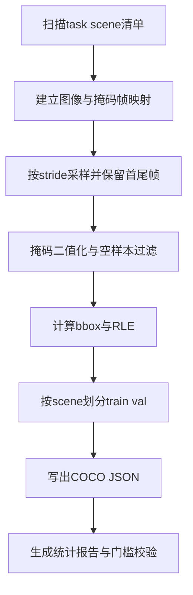

# 阶段A详细规格说明书（Spec）

## 1. 文档元信息

| 字段 | 内容 |
|---|---|
| 文档名称 | SAM3 微调阶段A详细规格说明书 |
| 文档版本 | v1.0.0 |
| 编写日期 | 2026-03-03 |
| 来源文档 | `plans/sam3_finetune_详细方案.md` |
| 适用范围 | 仅阶段A：数据集构建 |
| 作者 | `<待填写>` |
| 审阅人 | `<待填写>` |
| 状态 | Draft（待评审） |

---

## 2. 背景与问题定义

### 2.1 背景
当前目标是提升第0帧文本提示命中率和初始掩码稳定性。根据来源文档，本轮微调目标聚焦于图像模型入口，推理侧既有视频流程保持不变。

阶段A是后续训练效果的上限约束：若训练数据构建质量不足，阶段B/阶段C即使执行正确，也难以达到业务目标。

### 2.2 问题定义
当前缺少一套可复用、可审计、可验收的阶段A数据构建规范，具体表现为：
1. 输入路径、命名、采样、划分策略未形成强约束。
2. 质量门槛仅有原则，缺少统一量化验收标准。
3. 产物结构和统计口径未标准化，难以支撑训练对比和问题定位。

### 2.3 关键术语定义

| 术语 | 定义 |
|---|---|
| 关键帧采样 | 按固定步长从帧序列抽样，并强制保留首帧和尾帧 |
| no-mask | 缺失同名掩码文件（图像有、掩码无） |
| empty-mask | 掩码文件存在，但二值化后前景像素为0 |
| tight bbox | 由前景像素最小外接矩形计算出的 `xywh` |
| COCO `xywh` | 边界框格式，`x`,`y`,`w`,`h`，原点在左上角 |
| 压缩RLE | COCO兼容的 run-length encoding 压缩分割表示 |
| 场景级划分 | 以 scene 为单位划分 train/val，禁止同 scene 跨 split |

---

## 3. 阶段A目标（业务目标 + 技术目标）

### 3.1 业务目标
1. 为后续微调提供高一致性、高可追溯的数据资产，降低首帧定位不稳定风险。
2. 通过场景级划分建立可信验证集，保证后续指标具备可比较性。

### 3.2 技术目标
1. 从原图目录与 `_ckpt_arm` 掩码目录构建 COCO 格式 train/val 数据集。
2. 实现统一采样规则：默认 `sample_stride=30`，且必须保留首尾帧。
3. 对每个有效样本生成：`image`、`annotation`、`bbox(xywh)`、`segmentation(RLE)`。
4. 固化单类 `categories`，类名默认使用文本提示值 `robot and cable`。
5. 输出可审计统计结果并满足阶段A验收门槛。

---

## 4. 成功指标/KPI（量化阈值）

> 说明：分为“硬门槛”和“观测指标”。硬门槛不满足则阶段A不通过。

### 4.1 硬门槛（必须满足）

| KPI ID | 指标 | 计算方式 | 阈值 |
|---|---|---|---|
| KPI-A1 | split 非空 | `train_images>0 且 val_images>0` | 必须满足 |
| KPI-A2 | 样本一致性 | 每个 split 中 `len(images)==len(annotations)` | 100% |
| KPI-A3 | 场景隔离 | `train_scenes ∩ val_scenes` | 空集 |
| KPI-A4 | 标注完整性 | 每条 annotation 同时具备 `bbox`,`segmentation`,`category_id`,`image_id` | 100% |
| KPI-A5 | 类别一致性 | `categories` 仅1类且名称为目标类名 | 100% |

### 4.2 观测指标（用于质量评估与后续调参）

| KPI ID | 指标 | 目标区间 | 用途 |
|---|---|---|---|
| KPI-A6 | 有效采样率 | 建议 `>= 60%` | 判断掩码可用性 |
| KPI-A7 | no-mask 比例 | 建议 `<= 20%` | 判断输入目录配对质量 |
| KPI-A8 | empty-mask 比例 | 建议 `<= 30%` | 判断掩码语义与抽样策略 |
| KPI-A9 | scene 覆盖率 | `train_scene_count >= 1` 且 `val_scene_count >= 1` 且 `val_task_coverage_rate >= max(20%, val_ratio)`；自动划分时额外满足 `val_scene_count = min(max(1, ceil(val_ratio * N_scene)), N_scene - 1)` | 判断泛化基础 |

> KPI-A9 计算口径：
> - 统计对象：split 生成后的去重 scene 清单（`task/scene`），统计时间点为“split清单冻结后、样本构建前”。
> - `N_scene = |all_scenes|`，`train_scene_count = |train_scenes|`，`val_scene_count = |val_scenes|`。
> - `val_task_coverage_rate = |tasks_in_val| / |tasks_in_all_scenes|`。
> - 通过条件：同时满足表中阈值；若 `N_scene < 2`，则 KPI-A9 直接判定不通过。
>
> 注：KPI-A6~A9为建议目标区间，若偏离需在阶段A报告中说明原因并给出修正动作。

---

## 5. 范围（In Scope）与非范围（Out of Scope）

### 5.1 In Scope
1. 阶段A数据构建规范定义。
2. 输入目录扫描、图像掩码配对、关键帧采样、空样本过滤。
3. COCO `train/annotations.json` 与 `val/annotations.json` 生成规范。
4. 场景级 train/val 划分策略与质检规则。
5. 数据构建统计报告字段与验收流程。

### 5.2 Out of Scope
1. 阶段B训练配置编写与调参。
2. 阶段C训练执行与checkpoint管理。
3. 阶段D回灌、推理对比与业务A/B验证。
4. 视频模型入口改动、ipynb改写、集群调度改造。
5. 任何源代码实现细节与实际运行操作。

---

## 6. 前置条件与依赖（数据、算力、环境、外部资源）

### 6.1 数据前置条件
1. 原图数据满足路径模式：`{data_base}/{task}/train/{scene}/cam_105422061350/color/*.png`。
2. 掩码数据满足路径模式：`{export_base}/{task}/{scene}_ckpt_arm/*.png`。
3. 图像与掩码按帧文件名可匹配（同名或可推导映射）。
4. `_ckpt_arm` 掩码语义稳定，前景表示 arm 目标区域。

### 6.2 环境依赖
1. 可用 Python 环境与基础图像处理能力。
2. 支持 COCO JSON 写出与 RLE 编码。
3. 输出目录具备可写权限。

### 6.3 资源依赖
1. 本地磁盘空间可容纳抽样图像副本与双 split JSON。
2. 阶段A不依赖GPU算力。

### 6.4 外部资源依赖
1. 类别命名默认取自文本提示：`robot and cable`。
2. 来源方案文档用于边界约束与规则对齐。

---

## 7. 输入/输出定义（目录结构、命名规范、产物格式）

### 7.1 输入定义

| 输入项 | 类型 | 必填 | 说明 |
|---|---|---|---|
| `data_base` | 路径 | 是 | 原图根目录 |
| `export_base` | 路径 | 是 | 掩码根目录 |
| `output_dir` | 路径 | 是 | 数据集输出根目录 |
| `task_list` | 列表 | 否 | 指定任务子集，空则自动扫描 |
| `sample_stride` | 整数 | 否 | 默认30 |
| `val_scenes` | 列表 | 否 | 手工指定验证场景 |
| `val_ratio` | 浮点 | 否 | 自动划分比例，默认0.2 |
| `category_name` | 字符串 | 否 | 默认 `robot and cable` |

### 7.2 输出目录结构

```text
{output_dir}/
  images/
    {task}/
      {scene}/
        {frame}.png
  train/
    annotations.json
  val/
    annotations.json
  reports/
    dataset_summary.json
    dataset_summary.md
```

### 7.3 命名规范
1. 图像文件名保留原始帧名，例如 `000120.png`。
2. `image_id` 建议使用可追溯规则：`{task}__{scene}__{frame}`。
3. `annotation_id` 全局唯一、递增。
4. `categories` 固定单类，`id=1`。

### 7.4 COCO 产物格式要求
- `images` 字段：`id,file_name,width,height` 必填。
- `annotations` 字段：`id,image_id,category_id,bbox,segmentation,area,iscrowd` 必填。
- `bbox` 使用 `xywh`。
- `segmentation` 使用压缩RLE。
- `iscrowd` 统一为 `0`。

---

## 8. 技术方案（流程拆解、关键设计决策、可选方案对比与取舍）

### 8.1 流程拆解



### 8.2 关键处理规则
1. **帧采样规则**：先生成候选帧序列，再强制并入首帧与尾帧去重。
2. **空样本处理**：
   - 掩码文件缺失计入 `no-mask` 并跳过。
   - 二值化后前景为空计入 `empty-mask` 并跳过。
3. **bbox计算**：由前景像素集合计算最小外接矩形，输出为 COCO `xywh`。
4. **分割编码**：将二值mask编码为压缩RLE，保证后续 loader 兼容。
5. **自动划分细则（`val_scenes` 未指定时）**：
   - 先构建去重后的 `scene_list`，元素格式为 `{task}/{scene}`。
   - 排序键：先按 `task` 字典序升序；同一 `task` 内按 `scene` 自然序升序（数字片段按数值比较，非数字片段按字典序比较）；并以完整 `{task}/{scene}` 作为稳定兜底键。
   - 设 `N_scene = len(scene_list)`，`val_scene_count = ceil(val_ratio * N_scene)`。
   - 边界规则：当 `N_scene >= 2` 时，`val_scene_count = min(max(1, val_scene_count), N_scene - 1)`；当 `N_scene < 2` 时自动划分判定失败并触发风险 `R-A3`。
   - 尾部取值：`val_scenes = scene_list[-val_scene_count:]`，`train_scenes = scene_list[:-val_scene_count]`。
6. **防泄漏原则**：仅允许场景级划分，禁止帧级随机划分；同一 `scene` 不得跨 split 复用。

### 8.3 设计决策与备选方案对比

| 决策点 | 备选方案 | 取舍结论 | 原因 |
|---|---|---|---|
| 划分粒度 | 帧级随机 vs 场景级 | 采用场景级 | 避免时间相关样本泄漏 |
| 分割表示 | polygon vs 压缩RLE | 采用压缩RLE | 与既有训练loader兼容性更高 |
| 采样方式 | 全帧 vs stride抽样 | 采用stride抽样 | 降低冗余，控制数据规模 |
| 类别设计 | 多类拆分 vs 单类 | 采用单类 | 与当前文本提示目标一致 |

### 8.4 非功能要求
1. **可追溯性**：任一 annotation 可反查到 task/scene/frame。
2. **可重复性**：同输入参数重复构建应输出一致的 split 与计数。
3. **可诊断性**：必须输出完整统计报告与跳过原因计数。

---

## 9. 实施计划（步骤/里程碑）

> 说明：本节给出执行步骤，不包含代码实现。每步附带完成判定，并与第11节DoD对应。

| 里程碑 | 目标 | 关键动作 | 产物 | 完成判定 | 对应DoD |
|---|---|---|---|---|---|
| M1 参数冻结 | 固化输入边界与规则 | 确认路径模式、采样参数、划分策略、类别名 | 参数基线表 | 参数项无歧义且可执行 | DOD-01 |
| M2 数据盘点 | 形成场景与帧可用性清单 | 扫描task/scene，统计图像数、掩码数、可匹配数 | 盘点清单 | 盘点覆盖全部目标scene | DOD-02 |
| M3 split生成 | 形成无泄漏train/val | 按手工val_scenes或val_ratio进行场景级划分 | split清单 | train/val场景无交集 | DOD-03 |
| M4 样本构建 | 生成有效样本与标注 | 采样、首尾补齐、空样本过滤、bbox+RLE生成 | 中间样本索引 | 有效样本均具备完整字段 | DOD-04 DOD-05 |
| M5 产物输出 | 输出标准COCO结构 | 写出images目录与train/val JSON | 标准目录树+JSON | JSON结构可解析且字段完整 | DOD-06 DOD-07 |
| M6 质量验收 | 通过阶段A门槛 | 汇总统计、门槛校验、异常说明 | 统计报告与验收记录 | 硬门槛全部通过 | DOD-08 DOD-09 |

---

## 10. 角色与职责分工（RACI）

角色定义：
- **PM**：项目负责人
- **AE**：算法工程师
- **DE**：数据工程师
- **QA**：质量负责人
- **PO**：业务方代表

| 工作项 | PM | AE | DE | QA | PO |
|---|---|---|---|---|---|
| 阶段A边界确认 | A | R | C | C | I |
| 输入数据盘点 | I | C | R | C | I |
| split策略确认 | C | R | R | C | I |
| COCO规范对齐 | I | R | R | C | I |
| 质量门槛验收 | C | C | R | A | I |
| 假设与待确认项闭环 | A | R | C | C | C |

说明：R=负责执行，A=最终负责，C=协作评审，I=知会。

---

## 11. 验收标准（DoD检查清单）

### 11.1 DoD条目

| DoD ID | 检查项 | 判定标准 | 证据产物 |
|---|---|---|---|
| DOD-01 | 参数完整性 | 输入参数字典完整且有默认值规则 | 参数基线表 |
| DOD-02 | 输入覆盖性 | 目标task/scene扫描完成，无漏扫 | 盘点清单 |
| DOD-03 | split无泄漏 | train/val scene交集为空 | split清单 |
| DOD-04 | 样本有效性 | 空样本全部过滤，跳过计数可追踪 | 统计报告 |
| DOD-05 | 标注完整性 | 每条annotation具备必填字段与合法值 | JSON抽检记录 |
| DOD-06 | 目录结构合规 | 输出目录满足约定结构 | 目录快照 |
| DOD-07 | JSON可用性 | `annotations.json` 可被标准JSON解析 | 解析结果记录 |
| DOD-08 | 硬门槛通过 | KPI-A1~A5 全部满足 | 验收结论单 |
| DOD-09 | 报告完备性 | 包含总量、split计数、跳过计数、`KPI-A6~A9` 数值、风险触发判定与异常说明 | `reports/dataset_summary.md` |

### 11.2 实施计划与DoD对应关系
- M1 -> DOD-01
- M2 -> DOD-02
- M3 -> DOD-03
- M4 -> DOD-04, DOD-05
- M5 -> DOD-06, DOD-07
- M6 -> DOD-08, DOD-09

---

## 12. 风险清单与缓解预案（含触发条件与应急动作）

> 触发口径统一定义：
> - 连续窗口：最近连续2次完整构建，且输入参数基线一致（`task_list`、`sample_stride`、`val_ratio`、`category_name`）。
> - 持续超阈值：对应 KPI 在该连续窗口内连续2次不达标。

| 风险ID | 风险描述 | 关联KPI | 触发条件 | 影响 | 缓解预案 | 应急动作 |
|---|---|---|---|---|---|---|
| R-A1 | 图像与掩码命名不一致 | KPI-A7 | `KPI-A7 > 20%` 且连续2次构建发生 | 有效样本不足 | 增加命名映射规则校验 | 先冻结异常scene，输出问题清单后补数 |
| R-A2 | 掩码大量为空 | KPI-A8 | `KPI-A8 > 30%` 且连续2次构建发生 | 标注质量下降 | 调整采样策略并复核掩码来源 | 临时提高抽样密度并重建该scene |
| R-A3 | split分布偏斜 | KPI-A9 | KPI-A9 不通过且连续2次构建发生 | 验证结果不可信 | 强制最小scene数与任务覆盖约束 | 立即重划split并重出报告 |
| R-A4 | RLE编码异常 | KPI-A4 | 当次构建出现 `KPI-A4 < 100%` 或抽检发现 `segmentation` 非法 | JSON不可用 | 增加编码前后校验 | 将异常样本隔离并记录，再补采样 |
| R-A5 | 输出不一致不可复现 | KPI-A9 | 同参数重复构建2次，`train_scene_count` 或 `val_scene_count` 不一致 | 难以定位问题 | 固定排序与随机种子策略 | 回滚到上次稳定参数重跑 |
| R-A6 | 磁盘容量不足 | KPI-A1 | 输出中断或写入失败导致 `KPI-A1` 不满足 | 产物不完整 | 构建前执行容量检查 | 清理中间文件并分批构建 |

---

## 13. 假设与待确认项

### 13.1 假设
1. `_ckpt_arm` 掩码语义与训练目标一致，不混入 gripper 或 merge 语义。
2. 图像与掩码使用一致的帧编号体系，可通过文件名稳定配对。
3. `category_name` 默认取 `robot and cable` 不会影响阶段A单类训练语义。
4. 自动划分时 `val_ratio=0.2` 可满足最小验证覆盖要求。

### 13.2 待确认项
1. **待确认-01**：`sample_stride=30` 在所有任务下是否会导致有效样本过稀。
2. **待确认-02**：是否需要按任务维度设置最小 `val_scene` 数量。
3. **待确认-03**：若场景帧数极短，首尾帧重合时是否需额外补采样。
4. **待确认-04**：`KPI-A6~A8` 观测阈值是否作为硬门槛纳入发布阻断。

---

## 14. 附录：执行命令模板或配置模板（仅模板，不执行）

### 14.1 数据构建命令模板

```bash
python robotarm_sam/build_finetune_dataset.py \
  --data-base <data_base> \
  --export-base <export_base> \
  --output-dir <output_dir> \
  --sample-stride 30 \
  --val-ratio 0.2 \
  --category-name 'robot and cable'
```

### 14.2 指定验证场景模板

```bash
python robotarm_sam/build_finetune_dataset.py \
  --data-base <data_base> \
  --export-base <export_base> \
  --output-dir <output_dir> \
  --sample-stride 30 \
  --val-scenes <scene_a,scene_b,scene_c> \
  --category-name 'robot and cable'
```

### 14.3 参数配置模板

```yaml
# dataset_build_config_template.yaml
inputs:
  data_base: <path_to_raw_data>
  export_base: <path_to_ckpt_arm_masks>
  output_dir: <path_to_output_dataset>

sampling:
  sample_stride: 30
  keep_first_frame: true
  keep_last_frame: true

split:
  mode: auto   # auto or manual
  val_ratio: 0.2
  val_scenes: []

category:
  id: 1
  name: robot and cable

quality_gate:
  require_non_empty_train: true
  require_non_empty_val: true
  require_image_annotation_match: true
  require_scene_leakage_zero: true
```

---

## 结论
本规格书将阶段A限定为“可复现的数据集构建与验收”，并通过参数基线、流程规则、DoD清单和风险预案形成闭环，可直接作为后续实现与验收依据。